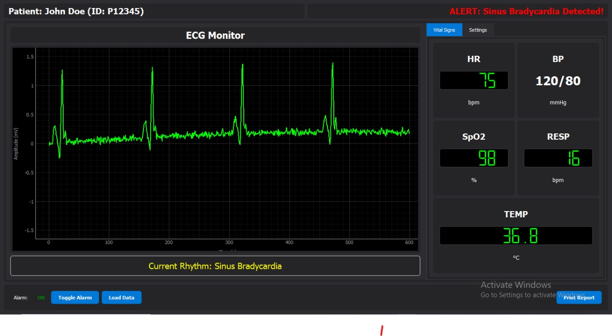

# ECG Patient Monitor

[](LICENSE)

A real-time ECG (Electrocardiogram) monitoring system that simulates a medical patient monitor with rhythm detection and vital signs tracking.



## 🩺 Features

- **Real-time ECG Display**: Visualize continuous ECG waveform data with smooth scrolling display
- **Rhythm Detection**: Automated detection of multiple cardiac rhythms:
  - Normal Sinus Rhythm
  - Atrial Fibrillation
  - Ventricular Fibrillation
  - Bradycardia
- **Vital Signs Monitoring**: Track and display critical patient parameters:
  - Heart Rate (HR)
  - Blood Pressure (BP)
  - Oxygen Saturation (SpO2)
  - Respiratory Rate (RESP)
  - Temperature
- **Alarm System**: Configurable alarms for abnormal cardiac rhythms and vital sign values
- **Data Management**: Load and analyze ECG data from various file formats
- **Report Generation**: Print patient monitoring reports

## 📋 Prerequisites

- Python 3.8 or higher
- PyQt5 for the graphical user interface
- pyqtgraph for real-time plotting capabilities
- NumPy and SciPy for signal processing

## 🚀 Installation

1. Clone this repository:

```bash
git clone https://github.com/yourusername/patient-monitor.git
cd patient-monitor
```

2. Install the required dependencies:

```bash
pip install -r requirements.txt
```

## 💻 Usage

Run the main application:

```bash
python main.py
```

### Sample Data

The application comes with several sample ECG datasets:

- `normal_ecg.csv` - Normal sinus rhythm
- `afib_ecg.csv` - Atrial fibrillation
- `vfib_ecg.csv` - Ventricular fibrillation
- `bradycardia_ecg.csv` - Bradycardia

You can select different data sources from the Settings tab or load your own ECG data files.

## 📁 Project Structure

```
patient-monitor/
├── main.py              # Application entry point
├── GUI.py               # User interface implementation
├── ECG_Processor.py     # Signal processing algorithms
├── Alarm_System.py      # Alarm management system
├── Data_Loader.py       # Data import functionality
├── ecg_samples/         # Sample ECG data files
│   ├── normal_ecg.csv
│   ├── afib_ecg.csv
│   ├── vfib_ecg.csv
│   └── bradycardia_ecg.csv
└── requirements.txt     # Project dependencies
```

## 🔍 Technical Details

The ECG Patient Monitor is built using several technologies:

- **PyQt5**: For the graphical user interface framework
- **pyqtgraph**: For efficient real-time data visualization
- **NumPy/SciPy**: For ECG signal processing and analysis
- **Pandas**: For data manipulation and loading different file formats

The application employs various signal processing techniques to detect different cardiac rhythms:

- QRS complex detection using bandpass filters
- R-R interval analysis for rhythm classification
- Spectral analysis for advanced arrhythmia detection
- Statistical methods for pattern recognition

## 👥 Contributors

<table>
  <tr>
    <td align="center">
      <a href="https://github.com/mahmoudmo22">
        <br />
        <sub><b>Mahmoud Mohamed</b></sub>
      </a>
    </td>
    <td align="center">
      <a href="https://github.com/MohamadAhmedAli">
        <br />
        <sub><b>Mohamed Ahmed</b></sub>
      </a>
    </td>
    <td align="center">
      <a href="https://github.com/momowalid">
        <br />
        <sub><b>Mohamed Walid</b></sub>
      </a>
    </td>
  </tr>
  <tr>
    <td align="center">
      <a href="https://github.com/MahmoudBL83">
        <br />
        <sub><b>Mahmoud Bahaa</b></sub>
      </a>
    </td>
    <td align="center">
      <div>
        <br />
        <sub><b>Mohamed Ashraf</b></sub>
      </div>
    </td>
  </tr>
</table>

## 📝 License

This project is licensed under the MIT License - see the [LICENSE](LICENSE) file for details.
